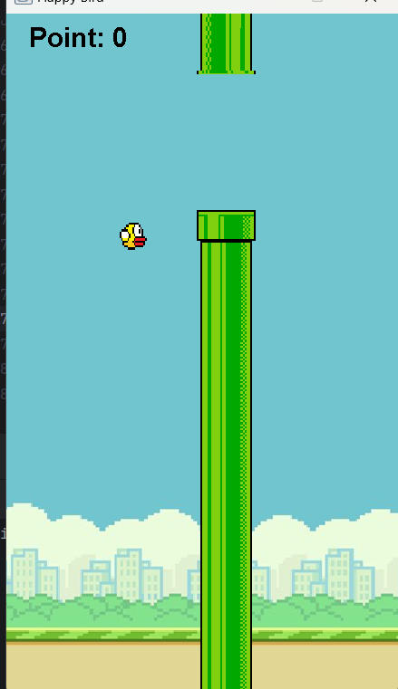
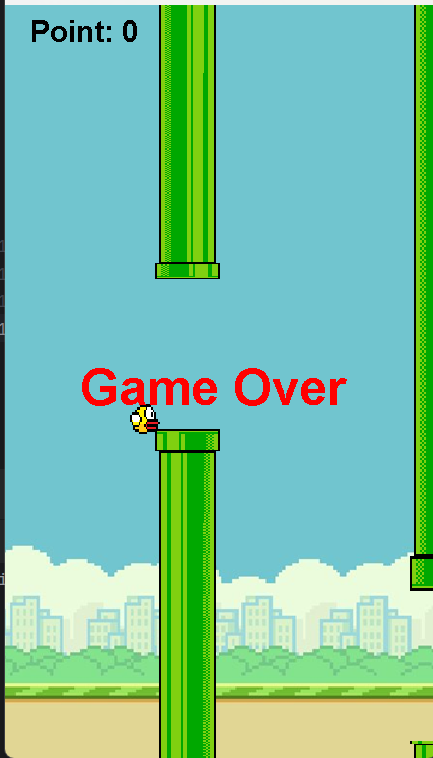

# Flappy Bird

Đây là một phiên bản đơn giản của trò chơi Flappy Bird được viết bằng Java sử dụng thư viện Swing. Trò chơi bao gồm một chú chim vượt qua các cặp ống di chuyển để ghi điểm, với mục tiêu đạt điểm cao nhất có thể.

## Tính năng
- Điều khiển chú chim bằng phím `Space` hoặc `Enter` để nhảy lên.
- Ống di chuyển từ phải sang trái với chiều cao ngẫu nhiên.
- Tính điểm: +1 điểm mỗi khi vượt qua một cặp ống.
- Game Over khi chim va chạm với ống hoặc rơi ra ngoài màn hình.
- Nhấn `R` để chơi lại sau khi thua.

## Minh họa
### giao diện chơi

### giao diện khi thua

### Tính điểm
